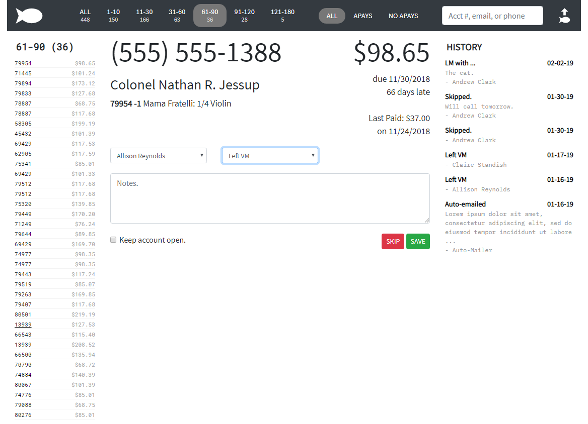

# THE FISHPOND

This is a contact-management app for retail stores who use the AIMsi P.O.S. system AND do their own collections on delinquent rental accounts. If that's you, this is your lucky day!

This was built upon panique's [MINI, an extremely simple barebone PHP application](http://www.dev-metal.com/mini-extremely-simple-barebone-php-application/).

This app takes data exported from AIMsi's Reports/Catalog/Contracts/Contract Statements report and presents it in manageable lists, sortable by aging category and autopay status. Each account appears in the main area with action dropdowns indicating that the customer was called, emailed, left a message, etc. Each account's contact history is also diplayed. Your store staff uses the Fishpond when making collection calls on delinquent rental accounts.

This app has no documentation right now! That's to do.

